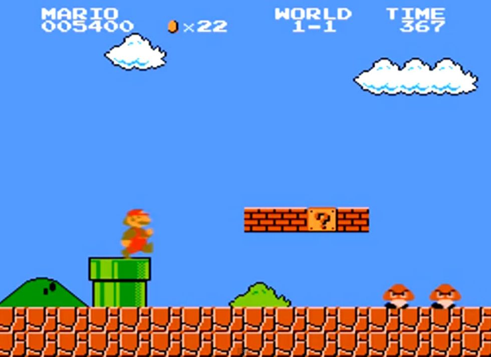

# Super Mario Bros Reinforcement Learning


This repository demonstrates the use of Reinforcement Learning (RL) to train an AI agent to play Super Mario Bros using the Proximal Policy Optimization (PPO) algorithm. It includes scripts for training, evaluating, and testing the RL model, along with a sample video of the agent in action.

## Repository Structure

- `log/`: Directory for TensorBoard logs.
- `CallBack.py`: Contains the custom callback for training and logging.
- `Evaluate.py`: Script to evaluate the trained model and print scores for several episodes.
- `README.md`: This file.
- `RandomAgent.py`: Script to run a random agent in the Super Mario Bros environment and record gameplay.
- `ReTrain.py`: Script to continue training a previously saved model.
- `Train.py`: Script to train a new PPO model.
- `requirements.txt`: List of required Python packages.

## Scripts Overview

### `RandomAgent.py`

Runs a random agent in the Super Mario Bros environment. The agent takes random actions, and gameplay is recorded and saved in `video/`.

### `Train.py`

Trains a new PPO model on the Super Mario Bros environment. Includes preprocessing steps like grayscale observation and frame stacking. Logs training progress in TensorBoard.

### `ReTrain.py`

Continues training a previously saved PPO model. Loads a model from `./Training/` and performs additional training.

### `Evaluate.py`

Evaluates the performance of a trained PPO model. Runs the model for a specified number of episodes and prints the score achieved in each episode.

## Installation

To run the scripts, you need the following Python packages. Install them using `requirements.txt`:

```bash
pip install -r requirements.txt
```
## Usage

- **Training a New Model**: Run `Train.py` to start training a new PPO model.
- **Re-training a Model**: Run `ReTrain.py` to continue training a previously saved model.
- **Evaluating a Model**: Run `Evaluate.py` to evaluate the performance of a trained model.
- **Random Agent**: Run `RandomAgent.py` to see the behavior of a random agent in the environment.

## Notes

- **Training Time**: Training may take significant time depending on the computational resources. The current setup uses CPU, and further improvements can be achieved with GPU acceleration.

## Example Gameplay

The image above shows a snapshot of the agent’s gameplay in Super Mario Bros.

## License

This project is licensed under the MIT License. See the [LICENSE](LICENSE) file for details.

